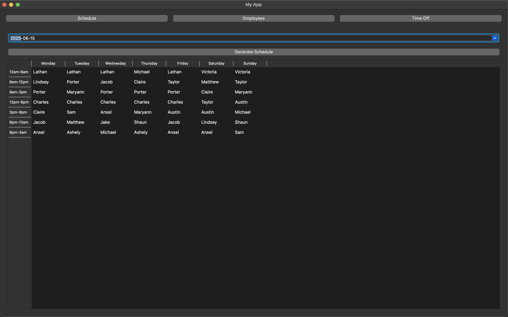
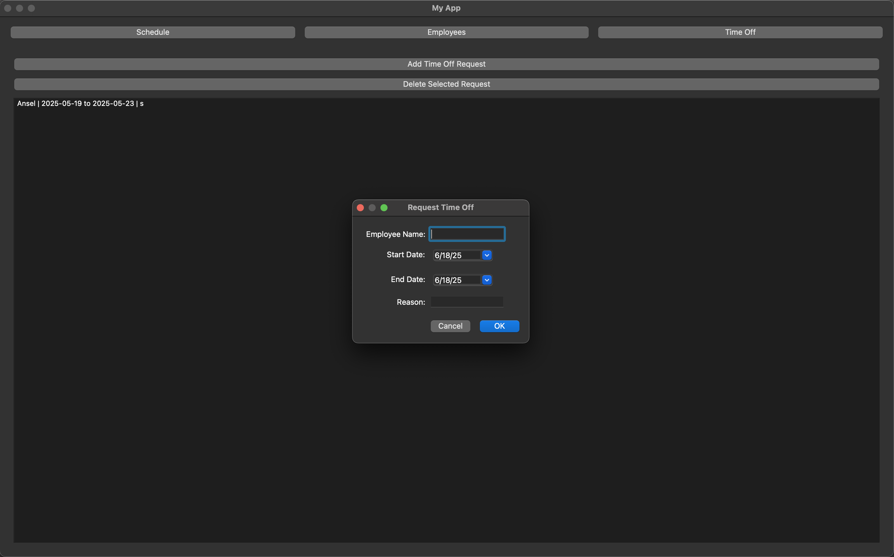
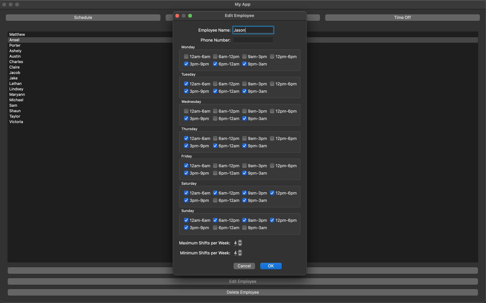
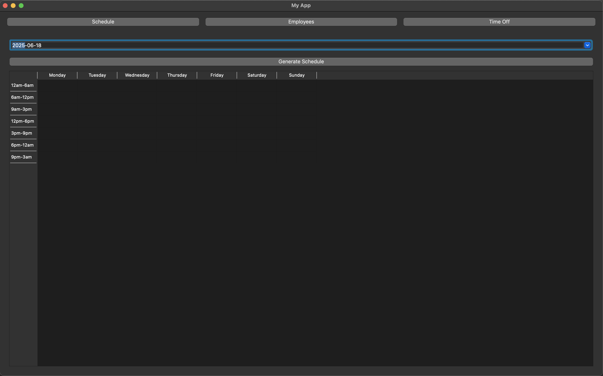

# Employee Scheduler

A desktop app for managing weekly work schedules. This PyQt5-based application allows users to manage employees, track time-off requests, and auto-generate weekly schedules based on constraints and preferences.

## 🧠 Features

- GUI with tabs for Schedule, Employees, and Time Off
- Add/edit/delete employee data
- Define employee availability and shift limits
- Submit and manage time-off requests
- Auto-generate weekly schedules
- Built-in calendar date selection

## 📸 Screenshots

### Generate Schedule View


### Time Off Management


### Employee Editor


### Blank Schedule Generation


## 🛠 Tech Stack

- Python 3.x
- PyQt5
- SQLite
- Qt Designer (optional, for UI design)

## 🚀 Running the App

### Prerequisites
```bash
pip install pyqt5
```

### Run the App
```bash
python main.py
```

The application will launch with a dark-themed GUI. All data is stored locally in `employees.db`.

## 📚 Learning Outcomes

- Built a full-stack local app using Python and PyQt5
- Designed modular GUI with multiple views and interaction states
- Used SQLite for persistent employee and time-off storage
- Improved UX through calendar widgets and constraint-based scheduling

## 📄 License

MIT — feel free to adapt and extend.
